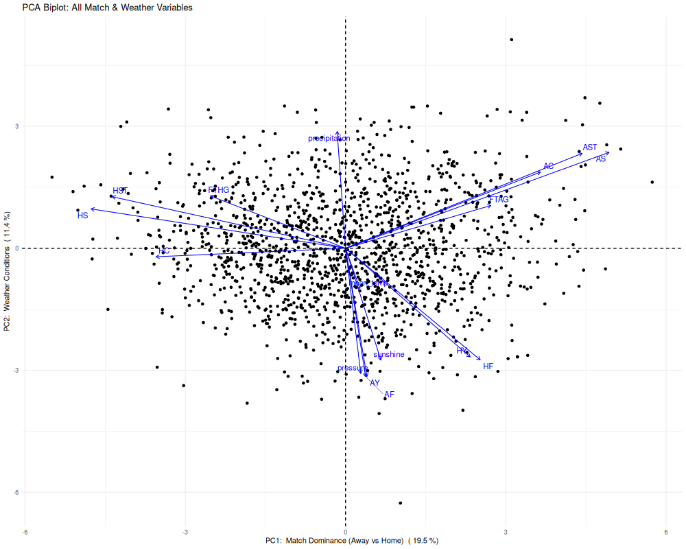
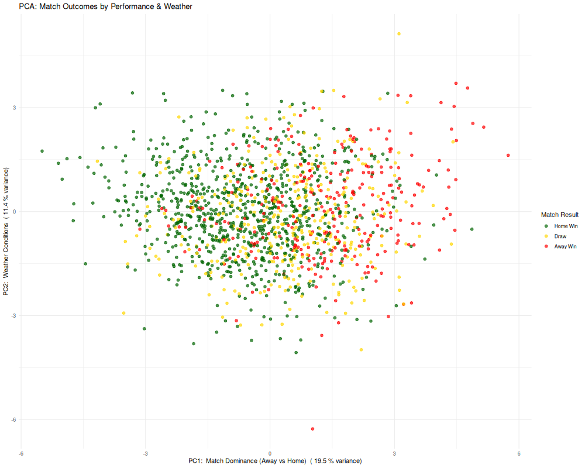
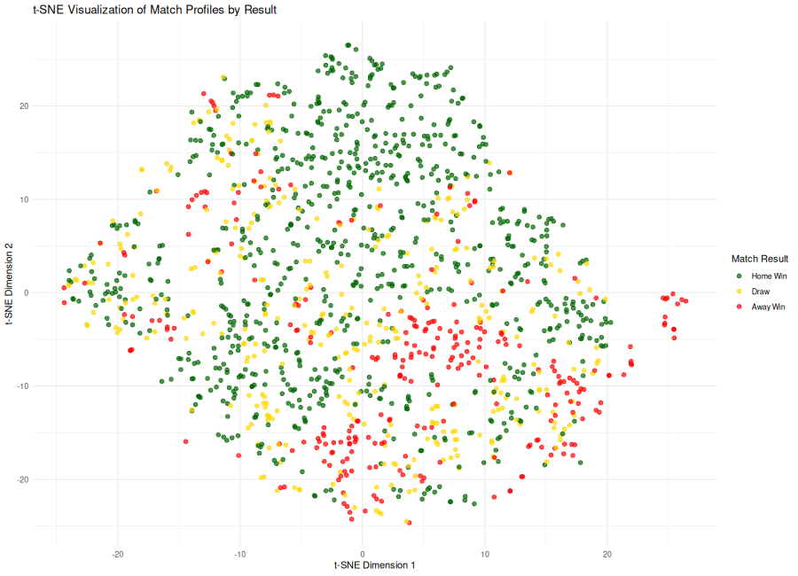
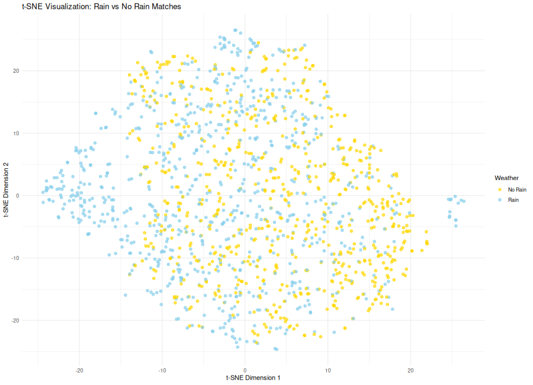
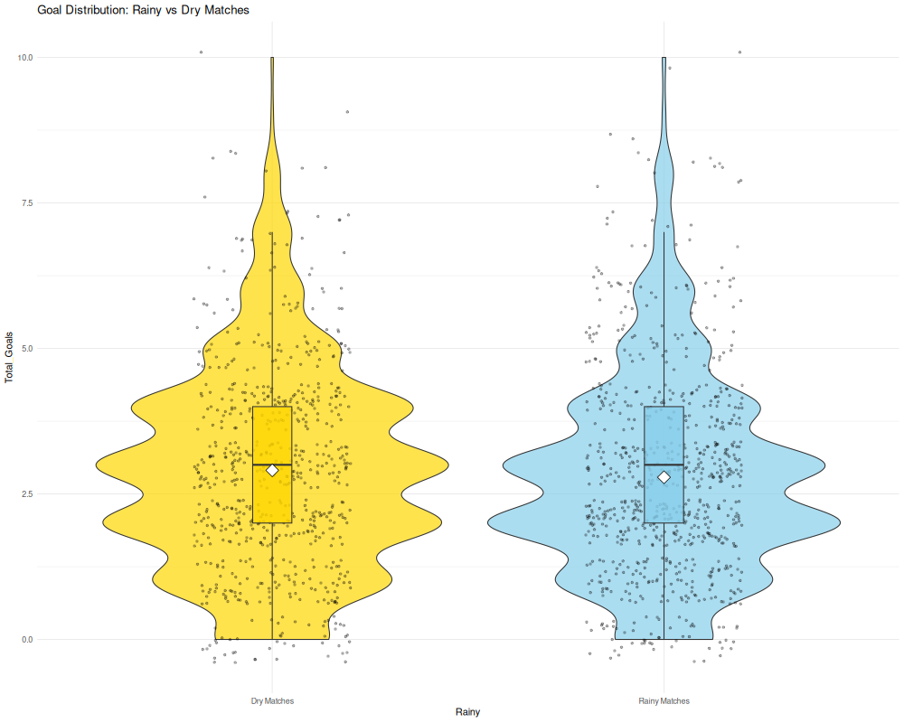

# **Introduction**

This project investigates whether weather conditions meaningfully affect match performance and outcomes in Premier League matches hosted by London-based clubs from 2000 to 2021.

Twenty-one seasons of match statistics were merged with historical London weather records to evaluate how meteorological factors interact with football performance.

The primary guiding question is:

**Do weather conditions influence match outcomes or gameplay behavior, or do traditional performance metrics dominate?**

My motivation for pursuing this analysis comes from a project I completed last year, where I built a Champions League match outcome predictor that achieved strong accuracy using team performance metrics. Afterward, I began to wonder whether there were additional external variables that could further improve predictive power. Weather stood out as a potentially overlooked factor, especially given its influence on ball movement, pitch conditions, and player fatigue. This project explores whether incorporating weather could strengthen predictive models or whether its impact is minimal compared to standard match statistics.

The analyses performed include:

- **Principal Component Analysis (PCA)**
- **t-SNE nonlinear dimensionality reduction**
- **Goals vs weather analysis** using violin plots and rain-intensity comparison
- **Machine learning classification using XGBoost**
- **Partial correlations** to isolate the direct effect of weather

---

# **Data Description**

This project combines two primary data sources: Premier League match statistics and daily London weather records. The dataset covers all home matches played by London-based clubs between the 2000 and 2021 seasons. Each season was processed individually to ensure that only matches hosted by the correct teams were included, accounting for promotions, relegations, and name variations across years.

The merged dataset contains 1,477 matches after filtering and cleaning.

## **Match Statistics**
These variables describe on-field performance and are standard across football analytics:
- Goals scored (`FTHG`, `FTAG`)
- Shots (`HS`, `AS`)
- Shots on target (`HST`, `AST`)
- Corners (`HC`, `AC`)
- Fouls (`HF`, `AF`)
- Yellow cards (`HY`, `AY`)
- Final result (`FTR`)

## **Weather Variables**
Weather data was sourced from daily London meteorological records and merged to match dates for each home fixture:
- Mean temperature (°C)
- Sunshine hours
- Precipitation (mm)
- Atmospheric pressure (hPa)

## **Dataset Construction and Filtering**
To accurately isolate London teams:
- Each season from 2000–2001 to 2020–2021 was loaded individually
- A curated dictionary mapped each season to the correct set of London clubs, accounting for:
  1) Promotions and relegations  
  2) Team renamings (e.g., Spurs vs Tottenham Hotspur)  
  3) Occasional short-term additions (e.g., Charlton, QPR, Fulham, Crystal Palace)  
- Only home matches for these teams were included  
- Matches missing key stats or weather data were removed using complete-case filtering  
- Weather was merged by date using standardized formats  

This produced a clean, analysis-ready dataset suitable for statistical modeling, visualization, and machine learning.

---

# **Principal Component Analysis (PCA)**

PCA reduces high-dimensional match and weather features into orthogonal components that summarize the strongest sources of variation in the dataset. This allows us to understand which types of variables influence the overall structure of London Premier League matches.

```{r, echo=FALSE}

```

### **Interpretation**

The biplot overlays match points with loadings (arrows) showing how each variable contributes to the first two principal components.

**PC1: Match Dominance (19.5 percent of variance)**  
PC1 captures a strong contrast between home-side attacking pressure and away-side attacking pressure:
- Positive direction: Away shots, away shots on target, away corners, away goals  
- Negative direction: Home shots, home shots on target, home corners, home goals  

This axis effectively measures which team controlled the match.  
Large positive PC1 scores correspond to matches where the away team dominated; large negative scores correspond to home dominance.

**PC2: Weather Conditions (11.4 percent of variance)**  
PC2 loads primarily on:
- Precipitation  
- Temperature  
- Sunshine  
- Atmospheric pressure  

Together, these form a weather-driven gradient.  
Importantly, this axis is orthogonal to PC1, meaning weather varies independently from match dominance.

**Key Takeaways**
- Gameplay variables overwhelmingly drive the structure of the dataset  
- Weather contributes measurable variance but is not a primary determinant of match patterns  
- Weather effects appear subtle compared to tactical and performance-driven metrics  

---

# **PCA Colored by Match Result**

```{r, echo=FALSE}

```

### **What This Plot Shows**

When the same PCA projection is colored by outcome (home win, draw, away win), we observe:
- Substantial overlap across all three outcomes  
- No clear clusters emerge for home-win vs draw vs away-win matches  
- Slight tendencies remain:
  1) Away wins show slightly more spread toward the right (higher away dominance)  
  2) Home wins lean slightly left, where home attacking variables load  
  3) Draws remain centered, as expected  

### **Interpretation**

- Match outcomes are not linearly separable using the combined match and weather feature space  
- This aligns with intuition: football outcomes are influenced by tactical decisions, finishing ability, and randomness, which PCA does not explicitly account for  
- It also demonstrates why machine learning classifiers cannot achieve perfect accuracy even when using detailed match statistics  

---

# **t-SNE Dimensionality Reduction**

t-SNE is a nonlinear dimensionality reduction technique that emphasizes local similarity, allowing us to visualize subtle clustering patterns in match profiles that PCA may not capture.

```{r, echo=FALSE}

```

### **Interpretation**

- The embedding shows soft clusters of matches with similar statistical profiles (for example, high-attacking matches vs low-event matches)  
- However, when colored by match result (Home Win, Draw, Away Win), the clusters remain highly overlapping, consistent with the PCA findings  
- Home wins tend to appear slightly more toward regions associated with stronger attacking statistics, while away wins spread more toward the opposite side  
- Boundaries between categories remain diffuse  

Even when capturing nonlinear relationships, t-SNE does not reveal clear outcome-based grouping.  
The match data contain structure, but that structure does not map cleanly onto win/draw/loss labels.

---

# **t-SNE by Weather Condition**

```{r, echo=FALSE}

```

### **Interpretation**

- Matches played in rain and matches played in dry conditions occupy the same regions of the t-SNE space  
- No meaningful separation emerges, even though t-SNE is designed to reveal subtle nonlinear structure  
- This indicates that weather conditions do not cluster matches into distinct performance profiles based on the statistical variables included  
- Rainy matches do not exhibit unique statistical signatures  

Even when nonlinear relationships are emphasized, weather does not measurably reorganize match behavior.  
This further supports the conclusion that meteorological conditions exert minimal influence on Premier League match dynamics.

---

# **Goals vs Weather Conditions**

This section examines whether scoring behavior changes under different rainfall conditions. We analyze both overall scoring distributions and goal averages across defined precipitation intensity categories.

---

# **Goal Distribution: Rainy vs Dry**

```{r, echo=FALSE}

```

### **Interpretation**

- Rainy and dry matches show almost perfectly overlapping scoring distributions  
- The median, interquartile range, and spread of total goals remain consistent regardless of rainfall  
- High-scoring outliers appear in both groups  

There is no statistical evidence that rain meaningfully affects scoring.

---

# **Average Goals by Rain Intensity Category**

# **Rain-Intensity Summary Table**

```{r}
read.csv("goals_by_precipitation_bins.csv")
```

### **Interpretation**

- Average goals per match remain stable across all rainfall categories (Dry, Light, Moderate, Heavy)  
- Scoring changes by only a few hundredths of a goal on average  
- Home and away goal averages remain nearly unchanged  
- Home win rate stays within a narrow band of roughly 0.5 to 0.6  
- Weather intensity does not meaningfully shift competitive balance  

Across both binary (rain vs dry) and graded precipitation levels, match scoring behaves consistently.  
Weather does not diminish attacking output or materially change match flow.

---

# **Predictive Modeling Using XGBoost**

An XGBoost classifier was trained to predict match outcomes (Home Win, Draw, Away Win) using both gameplay variables and weather measurements. The model was trained on 80 percent of the data and evaluated on the remaining 20 percent.

```{r, echo=FALSE}
cat(readLines("xgboost_acc.txt"))
```

### **Interpretation**

- XGBoost accuracy reflects its ability to capture meaningful patterns from match statistics  
- Gameplay variables like shots on target and total shots dominate feature importance  
- Weather variables such as temperature, precipitation, sunshine, and pressure contribute almost no predictive value  
- This aligns with earlier PCA and t-SNE findings showing weak separation by weather conditions  

The model reinforces the conclusion that match outcomes are overwhelmingly determined by gameplay performance, not weather.

---

# **Partial Correlation Analysis**

Partial correlations quantify the direct effect of weather variables on goal difference after removing gameplay influences such as shots, fouls, and goals.

```{r}
read.csv("partial_correlation_results.csv")
```

### **Interpretation**

- All partial correlations between weather variables and goal difference fall extremely close to zero  
- Once gameplay features are accounted for, weather has no meaningful standalone effect on outcomes  

This complements the findings from PCA, t-SNE, and XGBoost.  
Weather may shape environmental conditions, but its measurable statistical effect on match results is negligible.

---

# **Conclusions**

Across every analytical method used in this project, including PCA, t-SNE, scoring distributions, machine learning, and partial correlations, the results point to the same overarching insight:

- Gameplay performance is the primary factor that determines match outcomes  
- Weather contributes only small and inconsistent variation  
- Rainfall does not significantly change scoring patterns  
- Home advantage remains stable regardless of weather  
- Weather variables add almost no predictive power to outcome models  

**Final conclusion:**  
Weather does not meaningfully influence Premier League match outcomes, goal scoring, or competitive balance once gameplay performance is taken into account.

---

# **Future Work and Applications**

The findings of this project suggest that weather does not meaningfully influence match outcomes for Premier League clubs in London. However, several directions exist for expanding or applying this work.

## **Broader League Comparisons**

London clubs are accustomed to wet, variable weather.  
Teams in drier climates or warmer regions may react differently when experiencing rain or cold for the first time.  
Comparisons across European leagues may reveal stronger effects.

## **Lower Division Applications**

Premier League professionalism minimizes weather impact.  
Lower leagues may show larger weather-related effects due to:
- lower pitch quality  
- less advanced drainage  
- greater technical inconsistency  

Weather could influence:
- defensive errors  
- pass completion  
- goalkeeper performance  
- scoring volatility  

## **Live Prediction Systems**

Even if weather has minimal influence, combining gameplay and meteorological data can enhance:
- live win probability tools  
- in-game expected outcome models  
- analytics dashboards for broadcasters and teams  

## **Additional Weather Features**

More granular environmental variables could be explored:
- wind speed  
- humidity  
- pitch temperature  
- surface wetness  

## **General Insight**

The analytical framework developed here can be applied to other sports, other leagues, and other environmental contexts.

---

# **Reproducibility**

To rebuild the project:

```
docker build . -t project
docker run -e PASSWORD=mypassword -v $(pwd):/home/rstudio/work -p 8787:8787 project
make all
```

All figures and analyses regenerate automatically. The Makefile controls data import, modeling, visualization, and report compilation, ensuring full reproducibility from start to finish.